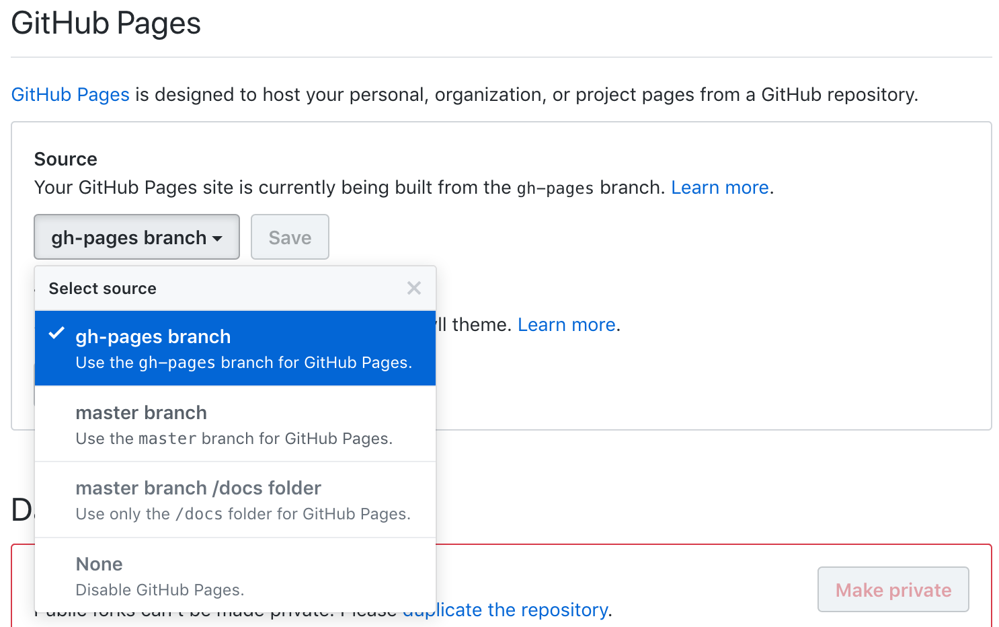
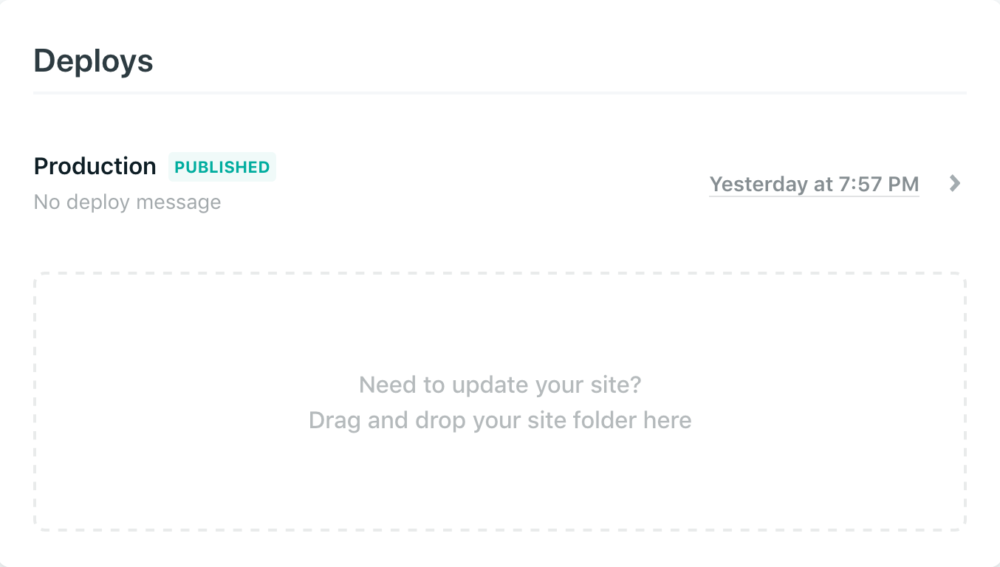

# Publishing

As you develop the book, you make the draft book available to the public to get early feedback from readers, e.g., publish it to a website. After you finish writing the book, you need to think about options to formally publish it as either printed copies or e-books.

## RStudio Connect

In theory, you can render the book by yourself and publish the output anywhere you want. For example, you can host the HTML files on your own web server. We have provided a function `publish_book()` in **bookdown** to upload your book to https://bookdown.org, which is a website provided by RStudio to host your books for free.\index{bookdown.org} This website is built on top of ["RStudio Connect",](https://www.rstudio.com/products/connect/)\index{RStudio Connect} an RStudio product that allows you to deploy a variety of R-related applications to a server, including R Markdown documents, Shiny applications, R plots, and so on.

You do not have to know much about RStudio Connect to publish your book to bookdown.org. Basically you sign up at https://bookdown.org/connect/, and the first time you try to run `bookdown::publish_book()`\index{bookdown::publish\_book()}, you will be asked to authorize **bookdown** to publish to your bookdown.org account. In the future, you simply call `publish_book()` again and **bookdown** will no longer ask for anything.

```{r publish-book-usage, eval=FALSE, code=formatR::usage(bookdown::publish_book, output=FALSE)}
```

The only argument of `publish_book()` that you may want to touch is `render`. It determines whether you want to render the book before publishing. If you have run `render_book()` before, you do not need to change this argument, otherwise you may set it to `'local'`:

```{r eval=FALSE}
bookdown::publish_book(render = 'local')
````

If you have set up your own RStudio Connect server, you can certainly publish the book to that server instead of bookdown.org.

## GitHub Pages {#ghpages}

You can host your book on GitHub\index{GitHub} for free via GitHub Pages (https://pages.github.com).^[See the [GitHub Pages Help documents](http://bit.ly/2cvloKV) for more information.] The simplest approach is to publish your book as a GitHub Project Page from a `/docs` folder on your `master` branch, which will then be available at `https://<USER>.github.io/<REPO>`. 

```{block2, publish_start, type='rmdnote'}
Start with a **bookdown** project linked to a remote GitHub repository that you can push/pull to from your local copy. To create a simple **bookdown** book to practice with instead, we suggest the following steps:
  
  + [Make a new repository on GitHub](https://happygitwithr.com/new-github-first.html#make-a-repo-on-github-2),
  + [Make a new RStudio Project via git clone](https://happygitwithr.com/new-github-first.html#new-rstudio-project-via-git-clone),
  + From your RStudio Project, run this command in your R console: `bookdown:::bookdown_skeleton(getwd())`,
  + [Change the title, save, and commit](https://happygitwithr.com/new-github-first.html#make-local-changes-save-commit-1),
  + [Push your local changes to GitHub](https://happygitwithr.com/new-github-first.html#push-your-local-changes-to-github).                 
```


1. Because the **bookdown** HTML output is a static, standalone website, you'll need to tell GitHub that your website is *not* to be built via Jekyll. Jekyll (http://jekyllrb.com) is a static website builder, which GitHub Pages supports by default. The key is to create a hidden, empty file named `.nojekyll` in your **bookdown** root directory as follows:

    ```bash
    # assume you have initialized the git repository,
    # and are under the directory of the book repository now
    
    # create a hidden file .nojekyll
    touch .nojekyll
    ```

    If you are on Windows, you may not have the `touch` command, and you can create the file in R using `file.create('.nojekyll')`. If you are using RStudio version 1.2 or higher, you can stage and commit this file using the RStudio GUI. 

1. Open the configuration file `_bookdown.yml`, set the output directory of your book to be `/docs` by adding the line `output_dir: "docs"`, and save this file.

1. Build your book locally, and push all your changes to GitHub (including the `.nojekyll` file). 

1. After you push these files, go to the repository site at `https://github.com/<USER>/<REPO>` and confirm that you see a `/docs` folder and a `.nojekyll` file. Click on the repository's settings and under "GitHub Pages" and change the "Source" to be "master branch `/docs` folder": 


After you have set up GIT, the rest of the work can be automated via a script (Shell, R, or Makefile, depending on your preference). Basically, you compile the book to HTML locally, then run git commands to push the files to GitHub. However, this approach assumes that:

1. You would like to store the rendered book (i.e., the `/docs` folder) on GitHub in your master branch.
1. You are satisfied using a project domain name like `https://<USER>.github.io/<REPO>`.

Although this is a straight-forward approach to publishing your book, it can be very handy to automate the publishing process completely on the cloud, so once it is set up correctly, all you have to do next is write the book and push the Rmd source files to GitHub, and your book will always be automatically built and published from the server side. To do this, you will want to utilize Travis CI\index{Travis CI} (https://travis-ci.org) to build the book in the cloud.

## Travis + GitHub Pages {#travis-ghpages}

Once you have gotten to the stage where your book files are **stored** in the cloud on GitHub, there are several additional steps to have your book also **built** and **deployed** in the cloud with every push to GitHub. The good news is that you only need to do these steps once!

After the initial setup, building and deploying your site in the cloud is as easy as with the [previous approach](#ghpages): every time you push to your master branch, this will trigger your book to be (re-)built, which will in turn trigger a fresh deploy to your GitHub Pages site at `https://<USER>.github.io/<REPO>`.

One benefit to this approach compared to the [previous approach](#ghpages) is that you are able to make changes to your book source files without needing to locally render the book. Any change to any `.Rmd` file in your book that is pushed to GitHub will set this build-deploy pipeline in motion, even if you do not or cannot build the book locally. This may be useful both when collaborating with yourself or with other people. 

Another benefit to this approach is that your master branch on GitHub will no longer store the rendered book files (i.e., the folders `_book` and `_bookdown_files`). Instead, those files will be present in a separate branch: the `gh-pages` branch. This means that your master branch will contain source files *only*.


### About Travis {#travis}

In case you are not familiar with Travis CI\index{Travis CI} (https://travis-ci.org), it is a service to continuously check your software in a virtual machine whenever you push changes to GitHub. It is a free service for public repositories on GitHub, and was designed for continuous integration (CI) of software packages. Travis CI can be connected to GitHub in the sense that whenever you push to GitHub, Travis can be triggered to run certain commands/scripts on the latest version of your repository.^[You need to authorize the Travis CI service for your repository on GitHub first. See https://docs.travis-ci.com/user/getting-started/ for how to get started with Travis CI.] These commands are specified in a YAML file named `.travis.yml` in the root directory of your repository, and they are usually for the purpose of testing software, but in fact they are quite open-ended, meaning that you can run arbitrary commands on a Travis (virtual) machine. That means you can certainly run your own scripts to build your book on Travis. Note that Travis only supports Ubuntu and Mac OS X at the moment, so you should have some basic knowledge about Linux/Unix commands. 


### Setup for continuous integration


```{block2, publish_start, type='rmdnote'}
```


```{block2, undo, type='rmdcaution'}
If you are starting from a [previous approach](#ghpages), we will not need to disable Jekyll (so you may wish to delete the `.nojekyll` file if created from Chapter \@ref(ghpages)), and if you previously changed your output directory to `"docs"` in the `_bookdown.yml`, you may want to either comment out (`#`) or delete that line to set the default output directory to `_book` (if you want a different directory, watch for replacing that in the code below).
```


### Instruct Travis to build your book from GitHub {#travis-yml}

+ Since this Travis service is primarily for checking R packages, you will need a (fake) `DESCRIPTION` file as if the book repository were an R package. You may use the command line to enter `touch DESCRIPTION` (or in R: `file.create('DESCRIPTION')`). The only thing in this file that really matters for a **bookdown** project is the specification of dependencies. Here a dependency corresponds to a package that you plan to use in your book. If a dependency is on CRAN or BioConductor, you first list it in the `Imports` field of the `DESCRIPTION` file; this is equivalent to Travis running `library(<PACKAGE>)` before building your book. If it is a package on GitHub, you will need to include the `USER/REPO` in the `Remotes` field (equivalent to `devtools::install_github(<"PACKAGE">)`), *and* add the package name to the `Imports` field as well (so GitHub packages will be listed in two places in this file). Below is an example:

    ```dcf
    Package: placeholder
    Type: Book
    Title: Does not matter.
    Version: 0.0.1
    URL: https://github.com/<USER>/<REPO>
    Imports: bookdown, ggplot2, icon
    Remotes: ropenscilabs/icon
    ```
    
    In the `URL` field, fill in your GitHub user name (`<USER>`) and the name of the repository (`<REPO>`). This field is not required by Travis, but can allow you to take advantage of some helpful `browse_*()` functions from the **usethis** package (https://usethis.r-lib.org/).

+ In addition to the `DESCRIPTION`, you also need to tell Travis how to build the book in a new file called `.travis.yml`. You can create this file in the terminal with:

  ```bash
  # create the file
  touch .travis.yml
  ```

  If you are on Windows, you can create the file in R using `file.create('.travis.yml')`. We'll provide a complete example of a `.travis.yml` file here, then walk through each of the sections step-by-step below:

  ```yaml
  language: R
  cache: packages
  pandoc_version: 2.3.1
  
  script:
  - Rscript -e 'bookdown::render_book("index.Rmd")'
  
  deploy:
    provider: pages
    local_dir: _book
    skip_cleanup: true
    github-token: $GITHUB_PAT  # Set in the settings page 
    on:
      branch: master
  ```

  This file tells Travis CI what to do. The `language` key tells Travis to use a virtual machine that has R installed. At a high-level, `script` tells Travis how to build the book; `deploy` gives Travis instructions for deploying the book. Be very careful with the indentation of the `.travis.yml` file as it is a YAML file so tabs and white space do matter.
  
+ You may wish to backup your local copies of the `_book` (unless you have modified your `output_dir` in your `_bookdown.yml` file) first, but you can safely delete and ignore both of these folders- these will now be built by Travis. You can open the `.gitignore` file and edit it directly. If your book was created as part of an R Project, your updated `.gitignore` would then look like this:

    ```
    .Rproj.user
    .Rhistory
    .RData
    .Ruserdata
    _book
    _bookdown_files
    ```
    
    You will still be able to build and preview your book locally (this will re-create your local `_book` folder), but those folders will no longer appear on your master branch in your remote GitHub repository.^[You must edit the `.gitignore` file **and** delete these local files, then commit/push to GitHub *before* building the book locally again for these changes to take effect.] 
    
    You could also use the function `edit_git_ignore()` function (https://usethis.r-lib.org/reference/edit.html) from the **usethis** package from within your R console. 
    
    ```{r eval = FALSE}
    ## install if needed (do this exactly once):
    ## install.packages("usethis")

    library(usethis)
    edit_git_ignore()
    ```
    
+ **Optional: Caching on Travis**  If you use the [container-based infrastructure](https://docs.travis-ci.com/user/workers/container-based-infrastructure/) on Travis, you can enable caching by using `sudo: false` in `.travis.yml`. Normally you should cache at least two types of directories: the figure directory (e.g., `_main_files`) and the cache directory (e.g., `_main_cache`). These directory names may also be different if you have specified the **knitr** chunk options `fig.path` and `cache.path`, but it's strongly recommended you not change these options. The figure and cache directories are stored under the `_bookdown_files` directory of the book root directory. A `.travis.yml` file that has enabled caching of **knitr** figure and cache directories may have additional configurations `sudo` and `cache` like this:

  ```yaml
  language: R
  pandoc_version: 2.3.1
  sudo: false
  
  cache:
  packages: yes
  directories:
  - _bookdown_files
  ...
  ```

  If your book is very time-consuming to build, you may use the above configurations on Travis to save time. Note that `packages: yes` means the R packages installed on Travis are also cached.
    
### Instruct Travis to publish your book on GitHub Pages {#travis-publish}

The Travis documentation shows how to deploy a site to GitHub Pages after a successful build: https://docs.travis-ci.com/user/deployment/pages/. You will need to grant Travis write access to your GitHub repository by providing a personal access token (PAT), and set the deployment provider details in `.travis.yml`. Here are a few steps you may follow:

+ **Create a GitHub personal access token** 

  To create a personal access token for your GitHub account, follow these [instructions](http://bit.ly/2cEBYWB)- select the `public_repo` or `repo` scope (`repo` is required for private repositories). You can view your PATs at https://github.com/settings/tokens. Be sure to copy the token to your clipboard; you may also wish to leave this browser window open while you navigate to Travis just in case. 

+ **Tell Travis your GitHub personal access token** 
    
  Go to `https://travis-ci.org/<USER>/<REPO>/settings` (or with the **usethis** package; the function `browse_travis()`) and save this PAT string as an "Environment variable", where `NAME` is anything you want it to be (we use `GITHUB_PAT` here as a placeholder only), and `VALUE` is where you paste the PAT from GitHub. You can leave the toggle button to right as is- this will keep your PAT private and will not show the value in your public build log. Click "Add". 

  If you know how to install and use the [Travis command-line tool](https://docs.travis-ci.com/user/environment-variables#defining-encrypted-variables-in-travisyml), you may instead encrypt it in the environment variable `GITHUB_PAT` via command line `travis encrypt` and store it in `.travis.yml`, e.g `travis encrypt GITHUB_PAT=TOKEN`. 

+ **Instruct Travis how to build and deploy the book** 

  + From your local **bookdown** project files, **add** the following section to your `.travis.yml` (see above for an example full `.travis.yml` file):
    
    ```
    deploy:
      provider: pages
      local_dir: _book
      skip_cleanup: true
      github-token: $GITHUB_PAT  # Set in the settings page of your repository
      on:
        branch: master
    ```
    
    The option `on` specifies that the deployment will only occur when the master branch is built. The `local_dir` option is the publish directory, which should be `_book` (unless you changed your `output_dir` in your `_bookdown.yml` file). Although not shown here, there is also a `target-branch` option, which specifies the branch where Travis should push the contents in the `local_dir` to, defaults to the `gh-pages` branch. Note that you do not need to create the `gh-pages` branch first- if one does not exist, Travis will create it on your first push.
    
  + Once you have your `DESCRIPTION`, `.travis.yml`, and `.gitignore` files ready, commit and push your changes to GitHub. This will trigger a new build on Travis; you should be able to watch your book's build progress on `https://travis-ci.org/<USER>/<REPO>` (or `usethis::browse_travis()`) . A successful build will end with log entries like:
    
    ```bash
    The command "Rscript -e 'bookdown::render_book("index.Rmd")'" exited with 0.
      
    Preparing deploy
    Deploying application
    Done. Your build exited with 0.
    ```

### Activate GitHub Pages {#activate-ghpages}

Following a successful build on Travis, navigate to your GitHub repository (you can do this from Travis by clicking on the octocat logo at the top of the page, or `usethis::browse_github()`). 

+ From `https://github.com/<USER>/<REPO>`, confirm that you see a `gh-pages` branch. 

+ Click on the repository's settings and under "GitHub Pages" and change the "Source" to be "gh-pages branch": 
    
    

+ **Optional: test your pipeline** You only need to do the steps above in sequence *once* per project. To see how this works, you can test the pipeline now. In your local **bookdown** project, make a small insignificant change- you could add a `subtitle` field in the YAML of your `index.Rmd` file like:

    ```
    --- 
    title: "A Minimal Book Example"
    subtitle: "I'm a book built in the cloud!"
    site: bookdown::bookdown_site
    ---
    ```
    
    Commit and push to GitHub (note: you do not have to build your book locally first!), then log onto Travis (`https://travis-ci.org/<USER>/<REPO>`) and GitHub (`https://github.com/<USER>/<REPO>`) and watch as your book gets built and committed to your `gh-pages` branch. A few minutes after your last push to GitHub, you should see your extra line of text appear at `https://<USER>.github.io/<REPO>`. 
    Alternatively you could run these **usethis** functions in your R console to pull up both relevant websites:
    ```{r eval = FALSE}
    library(usethis)
    browse_travis()
    browse_github()
    ```
     

### Optional: separate build and deploy scripts

With this setup working, you *could* separate your build and deploy scripts, rather than keeping them within a single `.travis.yml` file. With more complicated book builds, this may be preferred, and has the added benefit of allowing you to customize the commit message from Travis to your `gh-pages` branch. 

+ Edit your `.travis.yml` as follows:

  ```yaml
  language: R
  cache: packages
  pandoc_version: 2.3.1
  
  before_script:
    - chmod +x ./_build.sh
    - chmod +x ./_deploy.sh
  
  script:
    - ./_build.sh
    - ./_deploy.sh
  ```

+ Create two new Shell scripts in the `master` branch named `_build.sh` and `_deploy.sh`. 

+ An example `_build.sh` script could look like:

  ```bash
  Rscript -e "bookdown::render_book('index.Rmd', 'bookdown::gitbook')"
  Rscript -e "bookdown::render_book('index.Rmd', 'bookdown::pdf_book')"
  Rscript -e "bookdown::render_book('index.Rmd', 'bookdown::epub_book')"
  ```

+ An example `_deploy.sh` script could look like:

  ```bash
  # clone the repository to the book-out directory
  git clone -b gh-pages https://${GITHUB_PAT}@github.com/${TRAVIS_REPO_SLUG}.git book-out
  cd book-out
  cp -r ../_book/* ./
  git add --all *
  git commit -m "Update the book" || true
  git push -q origin gh-pages
  ```

  Note that in the above script, the only thing you might need to change is `GITHUB_PAT` with the **name** you gave to your Travis Environment Variable that stores your GitHub personal access token- this name could have been anything. `TRAVIS_REPO_SLUG` is a defined variable for Travis.

### Optional: customize commit messages in your deploy script

You can further customize your commit messages to be more specific than "Update the book." With these changes, the commit messages in your `gh-pages` branch will be meaningful: you can see the shorthand commit ID and your commit message, and you can click on either to view the relevant commit history. 

+ Add one more line to `.travis.yml` in the `before_script` section as follows (keep all other YAML elements as before):

  ```
  before_script:
    - export DEPLOY_MSG="${TRAVIS_COMMIT:0:7} ${TRAVIS_COMMIT_MESSAGE:0:70}"
  ```

+ In your `_deploy.sh` file, **edit** the `git commit -m "Update the book" || true` line, replacing the generic commit message `"Update the book"` with `"$DEPLOY_MSG"`. 

### Demo repository

All above scripts and configurations can be found in the `bookdown-travis-branch-deploy` repository: https://github.com/apreshill/bookdown-travis-branch-deploy.

## Netlify

Netlify (https://www.netlify.com/) is another option for hosting your static **bookdown** site, similiar to [GitHub Pages](#ghpages). Like GitHub Pages, Netlify provides a free plan. However, Netlify offers a few useful additional features like branch deploys and deploy previews. When you create a static site through Netlify, your website will be online in a few seconds with a random subdomain name of the form `http(s)://random-word-12345.netlify.com` provided by Netlify (you can customize the name). 

If you do not already have a Netlify account and you do have a GitHub account, we suggest you when you "Sign Up" and you see the options "Sign up with one of the following:" that you select `GitHub`. 


### Drag-and-drop deploy

Even though we encouraged you to sign up by linking Netlify to your GitHub account, drag-and-drop deploy is an option that does not rely on your **bookdown** project being in a GitHub repository. All you need for this approach is a **bookdown** project that you can build locally.^[If you want to create a local-only project to test Netlify's drag-and-drop deployment, create a new project with the RStudio Project Wizard by doing *File > New Project > New Directory > Book Project using bookdown*.]

The quickest way to deploy your **bookdown** book via Netlify is to log in and scroll to the bottom of the landing page where you should see a box like this:


From your **bookdown** project, build your book locally, then drag and drop the output directory (`_book` by default, unless you changed this in your `_bookdown.yml` file). You should see your book deploys quickly with a random subdomain name of the form `http(s)://random-word-12345.netlify.com`.

You *can* update this kind of site, but it is a manual update. In the Netlify UI, find your site and click on "Deploys". You should see this box (you may need to scroll to the bottom of this page):



Edit your book, build it locally again, then drag and drop the output directory here again. This workflow is great to quickly share a book prototype, but is not ideal for books you are actively editing or collaborating on. As you might expect, there is an easier long-term solution! We can connect GitHub to Netlify and use continuous deployment.

### Continuous deployment

As described in the Netlify documentation (https://www.netlify.com/docs/continuous-deployment/):

> "Continuous deployment works by connecting a Git repository to a Netlify site and keeping the two in sync."

Start with a **bookdown** project linked to a remote GitHub repository that you can push/pull to from your local copy.^[If you do not, you may wish to follow a "New project, GitHub first" workflow (See https://happygitwithr.com/new-github-first.html). After creating a new RStudio Project via git clone, you may run this command in your R console to build a simple **bookdown** book to practice with `bookdown:::bookdown_skeleton(getwd())`.]

If you have been trying out other publishing approaches like [using GitHub Pages](gh-pages), note that you do not need to worry about a `.nojekyll` file (you may wish to delete it if created from Chapter \@ref(ghpages)), and if you previously changed your output directory to `"docs"` in the `_bookdown.yml`, you may want to either comment out (`#`) or delete that line to set the default output directory to `_book` (if you want a different directory, watch for replacing that in the sample code we provide). Also check your `.gitignore` to make sure that you are *not* ignoring the `_book` directory.

The following steps will assume you are working from a GitHub repository, but Netlify currently supports GIT repositories hosted on GitHub, GitLab, and BitBucket.

+ Log in to Netlify.

+ Select "New site from Git". 

+ Follow these next steps within Netlify's "Create a new site" wizard:

  + *Step 1: Connect to Git provider.* Select GitHub. At this point, you may see a pop-up to let you know that Netlify is being authorized to access your GitHub. 

  + *Step 2: Pick a repository.* Find the Git repository attached to your **bookdown** project and select it. You can select from all of your personal repositories, or use the drop-down to select an organization that you are a part of. 

  + *Step 3: Build options, and deploy!* Start with deploying the master branch only. For the "Basic build settings", leave the Build Command blank. For the Publish Directory, choose your output directory- this will be `_book` by default.

+ **Optional: test your pipeline** In your local **bookdown** project, make a small insignificant change- you could add a `subtitle` field in the YAML of your `index.Rmd` file like:

    ```
    --- 
    title: "A Minimal Book Example"
    subtitle: "I'm a book continuously deployed on Netlify!"
    site: bookdown::bookdown_site
    ---
    ```
    
    Build your book locally, then commit and push all changes to GitHub. On Netlify, go to your site's page and click on "Deploy" to watch the deploy progress. A few minutes after your last push to GitHub, you should see your extra line of text appear at `http(s)://random-word-12345.netlify.com`.

+ **Optional: change the default subdomain** On Netlify from your site's landing page, click on *Overview > Site Settings*. Under "Site information" click on "Change site name" and update to `http(s)://<SUBDOMAIN-YOU-WANT-HERE>.netlify.com`. If you want to use a different domain, you need to configure some DNS records of the domain to point it to the Netlify server. 

## Travis + Netlify

Here we provide a beginner and an advanced workflow for using Travis CI to build your book, then using Netlify (free features only) to deploy your book. In case you are not familiar with Travis CI (https://travis-ci.org), you may want to read this [section](#travis) from Chapter \@ref(travis). 


If you are starting from any of the previous approaches, we will not need to disable Jekyll (so you do not need to worry about `.nojekyll` files, and you may wish to delete it if created from Chapter \@ref(ghpages)). Also, if you previously changed your output directory to `"docs"` in the `_bookdown.yml`, you may want to either comment out (`#`) or delete that line to set the default output directory to `_book` (if you want a different directory, watch for replacing that in the code below).

### Branch deploy {#netlify-branch}

This is a good workflow to start off integrating Travis and Netlify. We'll have Travis push the built book to the `gh-pages` branch (as in Chapter \@ref(travis)), but then we will link that branch (instead of the `master` branch) to Netlify. This takes advantage of Netlify's branch-specific auto-deployment feature, which will ignore any pushes to `master` and will only trigger a new deploy when Travis pushes a commit to the `gh-pages` branch.^[This avoids an awkward side effect of linking your `master` branch to both Travis and Netlify, which is that your site will go down whenever you first push a commit to GitHub. It would come back up once Travis pushes the built book back to `master`, but this is not really optimal. So we encourage you to start by *not* linking the same branches to both Travis and Netlify.] Deploys from the `gh-pages` branch **only** will be published automatically by Netlify.

+ Start with a **bookdown** project linked to a remote GitHub repository that you can push/pull to from your local copy.^[If you do not have one, you may wish to follow a "New project, GitHub first" workflow (See https://happygitwithr.com/new-github-first.html). After creating a new RStudio Project via git clone, you may run this command in your R console to build a simple **bookdown** book to practice with `bookdown:::bookdown_skeleton(getwd())`.] 

+ Follow all of the steps described in Chapter \@ref(travis-yml). Your remote GitHub repository (`https://github.com/<USER>/<REPO>` or open from within R with `usethis::browse_github()`) should now have the following files in place:

  + `DESCRIPTION`, 
  
  + `.travis.yml`, and 
  
  + `.gitignore` that includes `_book` (or whatever your `output_dir` is from your `_bookdown.yml` file) and `_bookdown_files`

+ Log on to Travis (`https://travis-ci.org/<USER>/<REPO>` or open from within R with `usethis::browse_travis()`). Your most recent build should be *green* and end with log entries like:
    
  ```bash
  The command "Rscript -e 'bookdown::render_book("index.Rmd")'" exited with 0.
    
  Preparing deploy
  Deploying application
  Done. Your build exited with 0.
  ```

+ Log in to Netlify, then do: *New site from Git > GitHub*

+ In Netlify's "Create a new site" wizard, do this:

  + *Step 1: Connect to Git provider.* Select GitHub.
  
  + *Step 2: Pick a repository.* Pick your **bookdown** repository.
  
  + *Step 3: Build options, and deploy!* Under "Branch to deploy", select `gh-pages` from the drop-down menu- leave all of the basic build settings blank. Deploy site.


+ **Optional: test your pipeline** In your local **bookdown** project, make a small insignificant change- you could add a `subtitle` field in the YAML of your `index.Rmd` file like:

    ```
    --- 
    title: "A Minimal Book Example"
    subtitle: "I'm a book built by Travis on a branch, then deployed by Netlify!"
    site: bookdown::bookdown_site
    ---
    ```
    Commit and push to GitHub (note: you do not have to build your book locally first!), then log onto Travis (`https://travis-ci.org/<USER>/<REPO>`) and GitHub (`https://github.com/<USER>/<REPO>`) and watch as your book gets built and committed to your `gh-pages` branch. Alternatively you could run these **usethis** functions in your R console to pull up both relevant websites:
    ```{r eval = FALSE}
    library(usethis)
    browse_travis()
    browse_github()
    ```
    
    On Netlify, go to your site's page and click on "Deploy" to watch the deploy progress. A few minutes after your last push to GitHub, you should see your extra line of text appear at `http(s)://random-word-12345.netlify.com`. 

All above scripts and configurations can be found in the `bookdown-travis-branch-deploy` repository: https://github.com/apreshill/bookdown-travis-branch-deploy. Now, if you also read the section detailing how to use Travis + GitHub Pages in Chapter \@ref(travis-ghpages), the above instructions may seem repetitive- and they are! These two approaches are basically the same, and in fact you can host the same book source files on *both* a GitHub Project Page (https://apreshill.github.io/bookdown-travis-branch-deploy/) and a Netlify site (https://bookdown-travis-branch-deploy.netlify.com/). The main downside to both of these approaches is that, although your book is built in the cloud, ultimately what is hosted is a fully-rendered site, which means that the rendered book files exist on GitHub (although we have now moved them to the `gh-pages` branch, so they are at least not cluttering up your `master` branch). 

### Deploy contexts {#netlify-prod}

All of the workflows thus far that we have covered that employ Travis to build your **bookdown** book (deployed via [GitHub Pages](travis-ghpages), or via [Netlify](netlify-branch)) rely on storing the rendered book files (i.e., those in the `_book` directory) in a branch within your GitHub repository. However, you can use Travis to build your book and deploy it to Netlify, while keeping only the book source files in your GitHub repository. To do this, we make use of Netlify deploy contexts.

+ Start with a **bookdown** project linked to a remote GitHub repository that you can push/pull to from your local copy.^[If you do not have one, you may wish to follow a "New project, GitHub first" workflow (See https://happygitwithr.com/new-github-first.html). After creating a new RStudio Project via git clone, you may run this command in your R console to build a simple **bookdown** book to practice with `bookdown:::bookdown_skeleton(getwd())`.] 

+ Add a `DESCRIPTION` file (update the `URL`, `Imports`, and `Remotes` fields as needed):

    ```dcf
    Package: placeholder
    Type: Book
    Title: Does not matter.
    Version: 0.0.1
    URL: https://github.com/<USER>/<REPO>
    Imports: bookdown, ggplot2
    Remotes: rstudio/bookdown
    ```

+ You may wish to backup your local copies of the `_book` and `_bookdown_files` first (unless you have modified your `output_dir` in your `_bookdown.yml` file), but you can safely delete and ignore both of these folders- these will now be built by Travis. An easy way to edit the `.gitignore` file is to use the **usethis** package (https://usethis.r-lib.org), with the function [`edit_git_ignore()`](https://usethis.r-lib.org/reference/edit.html). If your book was created as part of an R Project, your updated `.gitignore` would then look like this:

    ```
    .Rproj.user
    .Rhistory
    .RData
    .Ruserdata
    _book
    _bookdown_files
    ```
    
+ **Create a Netlify personal access token** 

  Log in to Netlify, and go to your account by clicking on your profile image at the top right, then select **"OAuth applications"** (https://app.netlify.com/account/applications). The Netlify site will lead you through two steps to generate then copy a personal access token (you may want to keep this browser window open).


+ **Tell Travis your Netlify personal access token** 

  On Travis, go to settings (`https://travis-ci.org/<USER>/<REPO>/settings` or `usethis::browse_travis()`) and enter a new **"Environment variable"**. The name of the variable should be `NETLIFY_AUTH_TOKEN`, and the value should be the personal access token from Netlify.

+ **Create a new Netlify site** 

  + Go back to Netlify, then do: *New site from Git > GitHub*

  + Click on **"Deploy site"** (don't change the branch to deploy or enter any basic build settings). We will override these in a moment so do not worry when your site does not deploy!

  + Go to your site's main page on Netlify then do: *Overview > General > Site details > Site information*. What you want is your new site's `API ID`, which is a long string of numbers and letters. Copy that string; we need to add it to your `.travis.yml` file.

+ **Instruct Travis how to build and deploy the book** 

  Create (or edit) the `.travis.yml` file for your **bookdown** project as follows:

    ```
    language: R
    sudo: false
    cache:
      packages: true
      directories:
      - $HOME/.npm
    pandoc_version: 2.3.1
    
    before_install:
      - nvm install stable
      - npm install netlify-cli -g
    
    env:
      - NETLIFY_SITE_ID=216f9e98-82ae-4699-87b6-5635a7f7f943
      # NETLIFY_AUTH_TOKEN set in travis settings
    
    script:
    - Rscript -e 'bookdown::render_book("index.Rmd")'
    
    deploy:
      - provider: script
        script: netlify deploy --dir _book --prod
        skip_cleanup: true
        on:
          branch: master
    ```
    
    This `.travis.yml` has a lot going on! The top portion is similar to the one we used earlier in Chapter \@ref(travis-yml). We have also added:
    
    + A `before_install` section, which installs the Netlify Command Line Interface (https://www.netlify.com/docs/cli/). This relies on Node.js version 8 or higher, which is installed on the first line that starts with `nvm` (stands for node version manager). The next line installs the Netlify tool using `npm`, a command line interface program to manage node.js libraries (stands for node package manager). 
    
    + An `env` section, which is where you store the Netlify `API ID` as the `NETLIFY_SITE_ID`. This tells Travis where to deploy the built book. 
    
    + The `script` tells Travis how to build the book (the same script as we used in Chapter \@ref(travis-yml)). 
    
    + The `deploy` section tells Travis to use a script to deploy, then we use the Netlify Command Line Interface tool to deploy the build directory `_book` (this would be different if you changed the `output_dir` in your `_bookdown.yml`), and we tell Netlify to use the production context with the `--prod` flag.
    
+ **Trigger Travis to Build & Deploy**
    
  + Once you have your `DESCRIPTION`, `.travis.yml`, and `.gitignore` files ready, commit and push your changes to GitHub. This will trigger a new build on Travis; you should be able to watch your book's build progress on `https://travis-ci.org/<USER>/<REPO>` (or `usethis::browse_travis()`) . A successful build will end with log entries like:
    
      ```bash
      The command "Rscript -e 'bookdown::render_book("index.Rmd")'" exited with 0.
      
      Preparing deploy
      Deploying application
      Done. Your build exited with 0.
      ```
    
+ **Instruct Netlify to Do Manual Deploys Only** 

  The final step here is critical! Without this step, Netlify will attempt to deploy every time you push to your master branch on GitHub. This means two things will happen: 1) your site will go down when you first push, because there is no book to deploy (as Travis has not yet built it!), and 2) you'll have two deploys for every push (the second one deploys from Travis and so will work). We need to disable this Netlify feature. Go online to Netlify and go to your site's *Overview > Site settings > Build & deploy*.  Scroll down to **"Deploy contexts"** and enter these settings:
  
  
  
  These settings essentially instruct Netlify to only do "manual deploys"- those that we tag with the production context label. If you look at our deploy script in your `.travis.yml`, we used the tag `--prod` to do this. You won't use this tag yourself- you'll only enable Travis to use it.
  
#### Optional: test your pipeline

In your local **bookdown** project, make a small insignificant change- you could add a `subtitle` field in the YAML of your `index.Rmd` file like:

```
--- 
title: "A Minimal Book Example"
subtitle: "I'm a book built and deployed with sorcery in the cloud!"
site: bookdown::bookdown_site
---
```
    
Commit and push to GitHub (note: you do not have to build your book locally first!), then log onto Travis (`https://travis-ci.org/<USER>/<REPO>`) and GitHub (`https://github.com/<USER>/<REPO>`) and watch as your book gets built and committed to your `gh-pages` branch. Alternatively you could run these **usethis** functions in your R console to pull up both relevant websites:

```{r eval = FALSE}
library(usethis)
browse_travis()
browse_github()
```
    
On Netlify, go to your site's page and click on "Deploy" to watch the deploy progress. A few minutes after your last push to GitHub, you should see your extra line of text appear at `http(s)://random-word-12345.netlify.com`. 

  
#### Optional: customize commit messages in your deploy script

You can further customize your commit messages to be more specific. With these changes, the commit messages in your Netlify deploy logs will be meaningful: you can see the shorthand commit ID and your commit message for every site deploy.

+ Add one more line to `.travis.yml` in the `before_install` section as follows (keep all other YAML elements as before):

  ```
  before_install:
    - export DEPLOY_MSG="${TRAVIS_COMMIT:0:7} ${TRAVIS_COMMIT_MESSAGE:0:70}"
  ```

+ Add `--message "$DEPLOY_MSG"` to the Netlify deploy script, also in your `.travis.yml` file. 

  ```
  deploy:
  - provider: script
    script: netlify deploy --dir _book --prod --message "$DEPLOY_MSG"
    skip_cleanup: true
    on:
      branch: master
  ```

#### Demo repository

All above scripts and configurations can be found in the `bookdown-travis-production-context` repository: https://github.com/apreshill/bookdown-travis-production-context.

## Publishers

Besides publishing your book online, you can certainly consider publishing it with a publisher\index{publisher}. For example, this book was published with Chapman & Hall/CRC, and there is also a free online version at https://bookdown.org/yihui/bookdown/ (with an agreement with the publisher). Another option that you can consider is self-publishing (https://en.wikipedia.org/wiki/Self-publishing) if you do not want to work with an established publisher. Pablo Casas has written two blog posts that you may find useful: ["How to self-publish a book"](https://blog.datascienceheroes.com/how-to-self-publish-a-book/) and ["How to self-publish a book: customizing bookdown"](https://blog.datascienceheroes.com/how-to-self-publish-a-book-customizing-bookdown/).

It will be much easier to publish a book written with **bookdown** if the publisher you choose supports LaTeX.\index{LaTeX} For example, Chapman & Hall provides a LaTeX class named `krantz.cls`, and Springer provides `svmono.cls`. To apply these LaTeX classes to your PDF book, set `documentclass` in the YAML metadata of `index.Rmd` to the class filename (without the extension `.cls`).

The LaTeX class is the most important setting in the YAML metadata. It controls the overall style of the PDF book. There are often other settings you want to tweak, and we will show some details about this book below.

The YAML metadata of this book contains these settings:

```yaml
documentclass: krantz
lot: yes
lof: yes
fontsize: 12pt
monofont: "Source Code Pro"
monofontoptions: "Scale=0.7"
```

For the PDF book, the field `lot: yes` means we want the List of Tables, and similarly, `lof` means List of Figures. The base font size is `12pt`, and we used [Source Code Pro](https://www.fontsquirrel.com/fonts/source-code-pro) as the monospaced (fixed-width) font, which is applied to all program code in this book.

In the LaTeX preamble (Section \@ref(yaml-options)), we have a few more settings. First, we set the main font\index{font} to be [Alegreya](https://www.fontsquirrel.com/fonts/alegreya), and since this font does not have the <span style="font-variant:small-caps;">Small Capitals</span> feature, we used the Alegreya SC font.

```latex
\setmainfont[
  UprightFeatures={SmallCapsFont=AlegreyaSC-Regular}
]{Alegreya}
```

The following commands make floating environments\index{floating environment} less likely to float by allowing them to occupy larger fractions of pages without floating.

```latex
\renewcommand{\textfraction}{0.05}
\renewcommand{\topfraction}{0.8}
\renewcommand{\bottomfraction}{0.8}
\renewcommand{\floatpagefraction}{0.75}
```

Since `krantz.cls` provided an environment `VF` for quotes, we redefine the standard `quote` environment to `VF`. You can see its style in Section \@ref(markdown-syntax).

```latex
\renewenvironment{quote}{\begin{VF}}{\end{VF}}
```

Then we redefine hyperlinks to be footnotes, because when the book is printed on paper, readers are not able to click on links in text. Footnotes will tell them what the actual links are.

```latex
\let\oldhref\href
\renewcommand{\href}[2]{#2\footnote{\url{#1}}}
```

We also have some settings for the `bookdown::pdf_book` format in `_output.yml`\index{\_output.yml}:

```yaml
bookdown::pdf_book:
  includes:
    in_header: latex/preamble.tex
    before_body: latex/before_body.tex
    after_body: latex/after_body.tex
  keep_tex: yes
  dev: "cairo_pdf"
  latex_engine: xelatex
  citation_package: natbib
  template: null
  pandoc_args: --top-level-division=chapter
  toc_unnumbered: no
  toc_appendix: yes
  quote_footer: ["\\VA{", "}{}"]
  highlight_bw: yes
```

All preamble settings we mentioned above are in the file `latex/preamble.tex`, where we also specified that the front matter starts:

```latex
\frontmatter
```
In `latex/before_body.tex`, we inserted a few blank pages required by the publisher and wrote the dedication page.
Before the first chapter of the book, we inserted

```latex
\mainmatter
```

so that LaTeX knows to change the page numbering style from Roman numerals (for the front matter) to Arabic numerals (for the book body).

We printed the index in `latex/after_body.tex` (Section \@ref(latex-index)).

The graphical device (`dev`) for saving plots was set to `cairo_pdf` so that the fonts are embedded in plots, since the default device `pdf` does not embed fonts. Your copyeditor is likely to require you to embed all fonts used in the PDF, so that the book can be printed exactly as it looks, otherwise certain fonts may be substituted and the typeface can be unpredictable.

The `quote_footer` field was to make sure the quote footers were right-aligned: the LaTeX command `\VA{}` was provided by `krantz.cls` to include the quote footer.

The `highlight_bw` option was set to true so that the colors in syntax highlighted code blocks were converted to grayscale, since this book will be printed in black-and-white.

The book was compiled to PDF through `xelatex` to make it easier for us to use custom fonts.

All above settings except the `VF` environment and the `\VA{}` command can be applied to any other LaTeX document classes.

In case you want to work with Chapman & Hall as well, you may start with the copy of `krantz.cls` in our repository (https://github.com/rstudio/bookdown/tree/master/inst/examples) instead of the copy you get from your editor. We have worked with the LaTeX help desk to fix quite a few issues with this LaTeX class, so hopefully it will work well for your book if you use **bookdown**.
